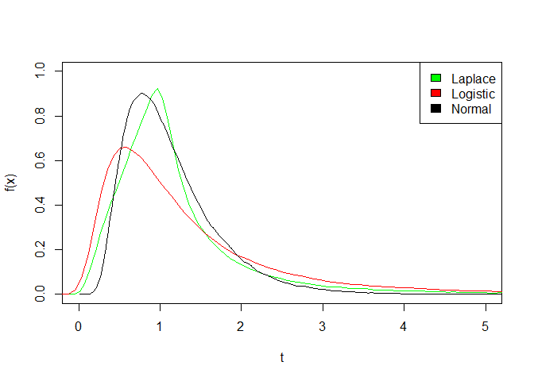

# Package for Generalized Birnbaum-Saunders Distributions


This is the R package of Michelli Barros, Victor Leiva, and Gilberto A. Paula with some improvements.

- bug fix in *la* (typo)
- the global variable *nuFixed* used in  *ksgbsc* changed to a parameter to comply with CRAN rules
- bug fix in *rgbs* in the laplace kernel case

Now the density function plots look similar to Figure 1 in the paper *An R implementation for generalized Birnbaum Saunders distributions* (Computational Statistics and Data Analysis 53 (2009), 1511-1528)


```r
rgbsExampleData <- data.frame( 
  Laplace  = rgbs(100000,  alpha = 0.5, beta = 1, kernel = "laplace"),
  Logistic = rgbs(100000,  alpha = 0.5, beta = 1, kernel = "logistic"),
  Normal   = rgbs(100000,  alpha = 0.5, beta = 1, kernel = "normal"))
dens <- apply(rgbsExampleData, 2, density)
plot(NA, xlim = c(0,5), xlab= "t",   ylim = c(0,1), ylab = "f(x)")
mapply(lines, dens, col = c("green","red","black"))
legend("topright", legend = names(dens), fill =  c("green","red","black") )
```

<!-- -->

